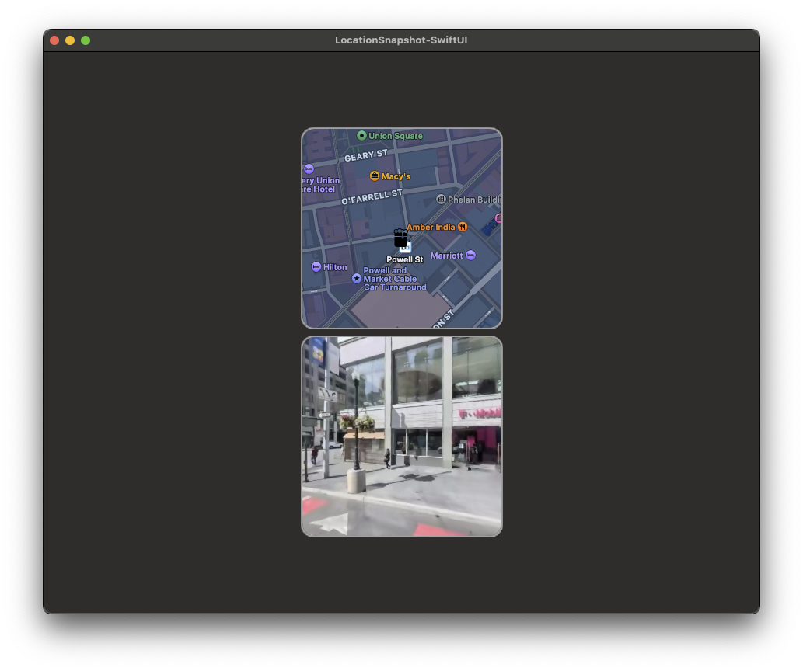
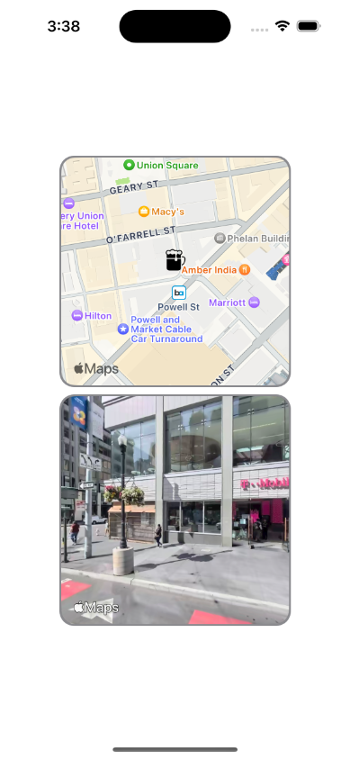

  

# LocationSnapshotter - SwiftUI

A re-implementation of [LocationShapShotter](https://github.com/RustyKnight/LocationShapShotter) in SwiftUI.

This makes use of `MKLookAroundSnapshotter` and `MKMapSnapshotter` to make snapshots of the current location.  It also draws a pin on the `MKMapSnapshotter` resulting image.

It's also cross platform.

 

<table>
  <tr>
    <td></td>
    <td></td>
   </tr> 
</table>
